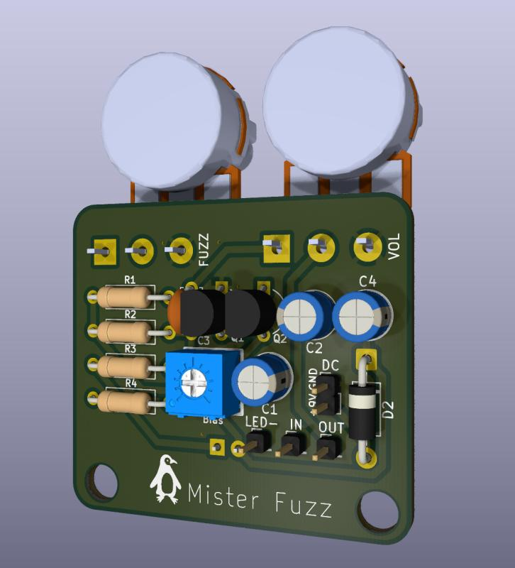

# Mister Fuzz - Silicon Fuzz Face Guitar Pedal

A silicon Fuzz Face guitar effects pedal designed end-to-end:
LTSpice simulation, breadboard prototype, custom KiCad PCB, and a
custom Fusion 360 enclosure.

## What this is

A classic Fuzz Face circuit rebuilt with modern 2N3904 NPN silicon
transistors instead of the original 1960s germanium PNPs. The substitution
required re-deriving the bias network for silicon's higher hFE, since the
original 8.2kΩ bias resistor leaves Q2's collector at the wrong operating
point with modern transistors. The production design uses a 10kΩ trim pot
in place of the fixed resistor, so each build can be tuned to the specific
2N3904s installed.

## Features

- 9V battery or 2.1mm DC barrel jack power, with automatic switchover
- TRS input jack that disconnects the battery when no cable is plugged in
- 1N4001 reverse-polarity protection diode
- 47µF supply decoupling capacitor
- 3PDT true-bypass switching with LED indicator
- 10kΩ bias trimmer (set Q2 collector to 4.5V during assembly)
- 500kΩ audio-taper volume control
- 1kΩ linear fuzz control
- Two-layer PCB with stitched ground pour for low-noise high-gain operation

## Repo layout

- `simulation/` contains the LTSpice schematic and plots from the analysis
- `hardware/` contains the KiCad project, schematic and PCB exports, Gerbers, and BOM
- `docs/` contains the design notes and bias tuning instructions
- `enclosure/` will contain the Fusion 360 enclosure model and drill template (coming soon)

## Design highlights

The full design walkthrough lives in [`docs/design-notes.md`](docs/design-notes.md).
Some of the more interesting findings:

- **The silicon variant required ~6kΩ bias resistance instead of the original
  8.2kΩ.** A parametric LTSpice sweep of R3 from 2kΩ to 10kΩ identified the
  value that lands Q2's collector at the target 4.5V with modern 2N3904s.
- **The circuit has approximately 62dB of peak passband gain.** At realistic
  guitar signal levels (~200mV), the pedal saturates fully at any fuzz setting
  above the lowest 10% of the pot's range. This is why the Fuzz Face cleans
  up so dramatically when you roll back the guitar's volume knob.
- **The fuzz control sculpts EQ, not just gain.** At maximum fuzz, the
  response shows a resonant peak at 115Hz (in the guitar's low fundamental
  range). At minimum fuzz, the response flattens into a near-clean wideband
  amplifier. The pot changes both gain and tonal character simultaneously.
- **Simulation results match published ElectroSmash reference data** within
  the expected silicon-vs-germanium tolerances. The silicon variant has a
  slightly higher low-frequency corner (~50-80Hz vs 14Hz for germanium),
  which matches the documented "less bass" character of silicon Fuzz Faces.

## Build

1. Order parts per `hardware/bom.csv`.
2. Send `hardware/gerbers/mister-fuzz-gerbers.zip` to a PCB fab house
   (JLCPCB, PCBWay, OSH Park, etc.).
3. Hand-solder all through-hole components.
4. Wire the panel-mounted parts (audio jacks, footswitch, DC jack, LED)
   to the PCB pad headers using hookup wire.
5. Set the bias trim pot per [`docs/bias-tuning.md`](docs/bias-tuning.md).
6. Install in the enclosure and play.

## License

MIT. See [`LICENSE`](LICENSE) for details. You're free to use, modify,
build, and sell this design with attribution.

## Acknowledgments

- ElectroSmash's Fuzz Face analysis at
  [electrosmash.com/fuzz-face](https://www.electrosmash.com/fuzz-face)
  for the canonical reference data this design was verified against.
- R.G. Keen's "The Technology of the Fuzz Face" on GEOFEX for the
  background on bias sensitivity and transistor selection.
- Barbarach's website and tutorials on designing and building a 
  Fuzz Face clone (https://barbarach.com/articles/building-a-fuzz-face-clone/)
- Dallas Arbiter and the original 1966 Fuzz Face designers, whose
  deceptively simple two-transistor circuit has kept guitarists and
  electronics hobbyists busy for nearly 60 years.